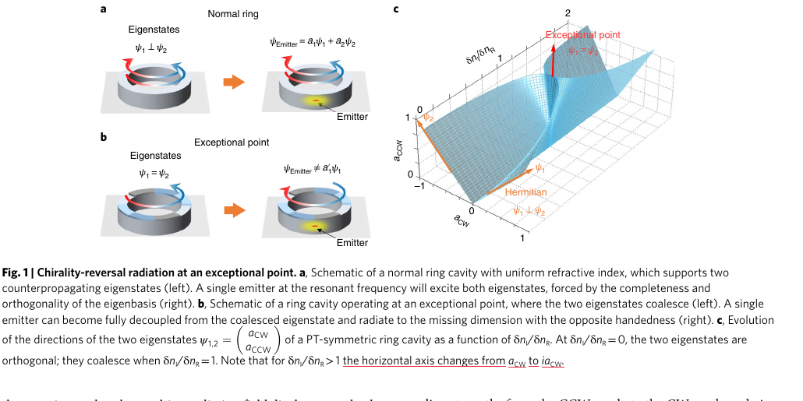
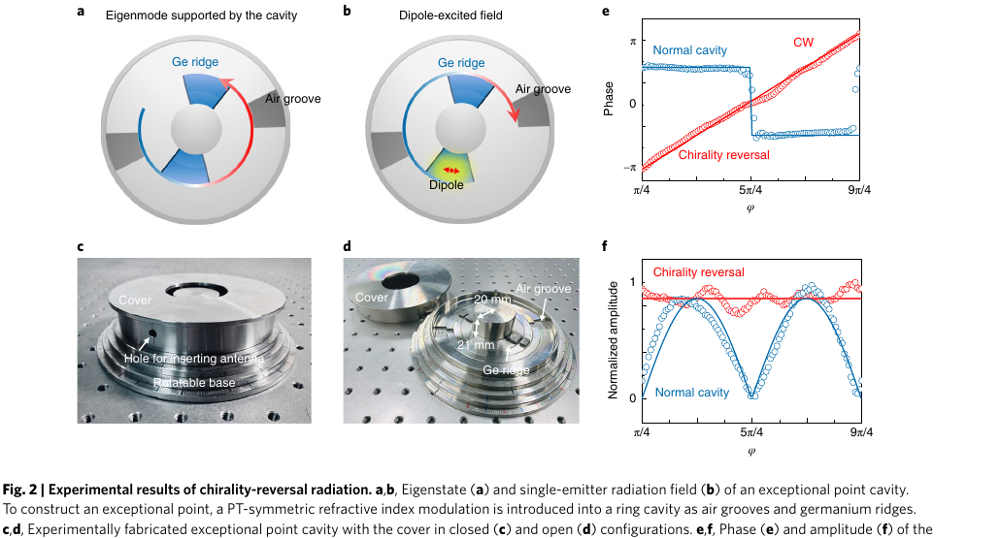
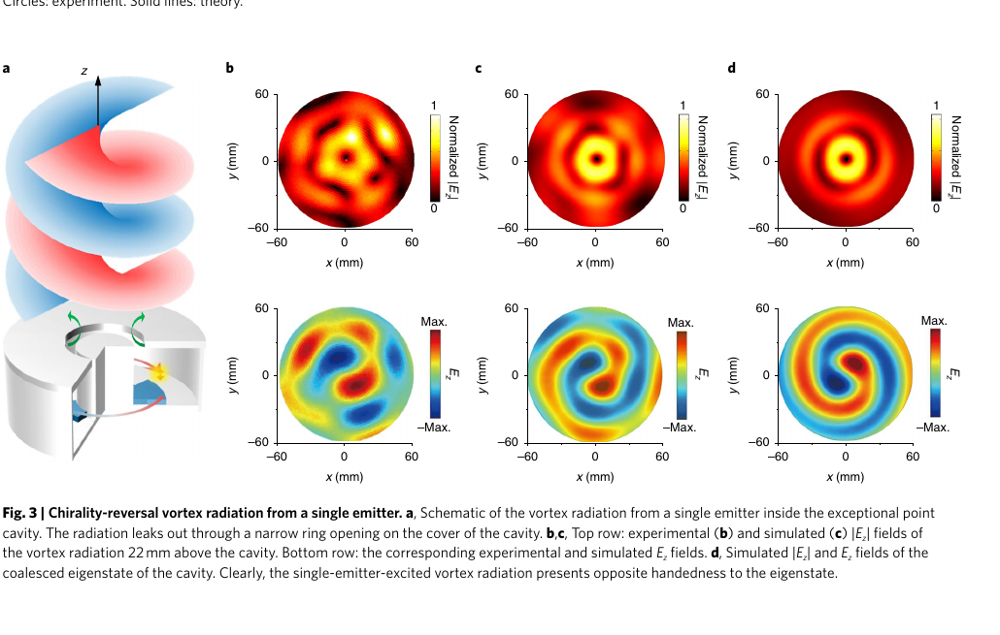
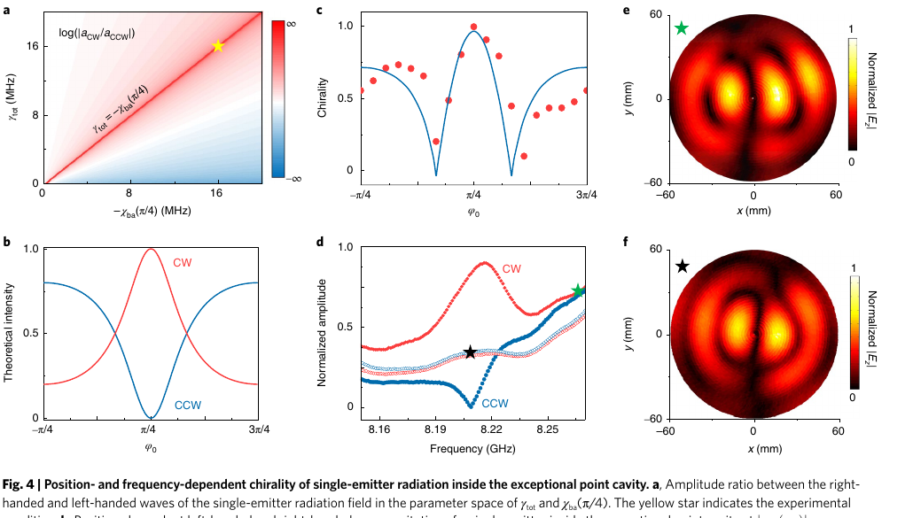
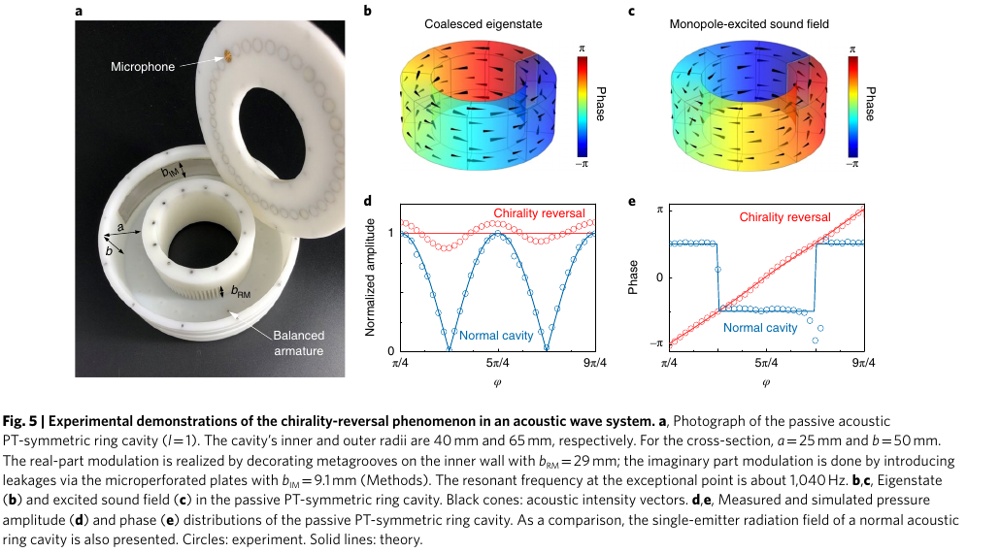
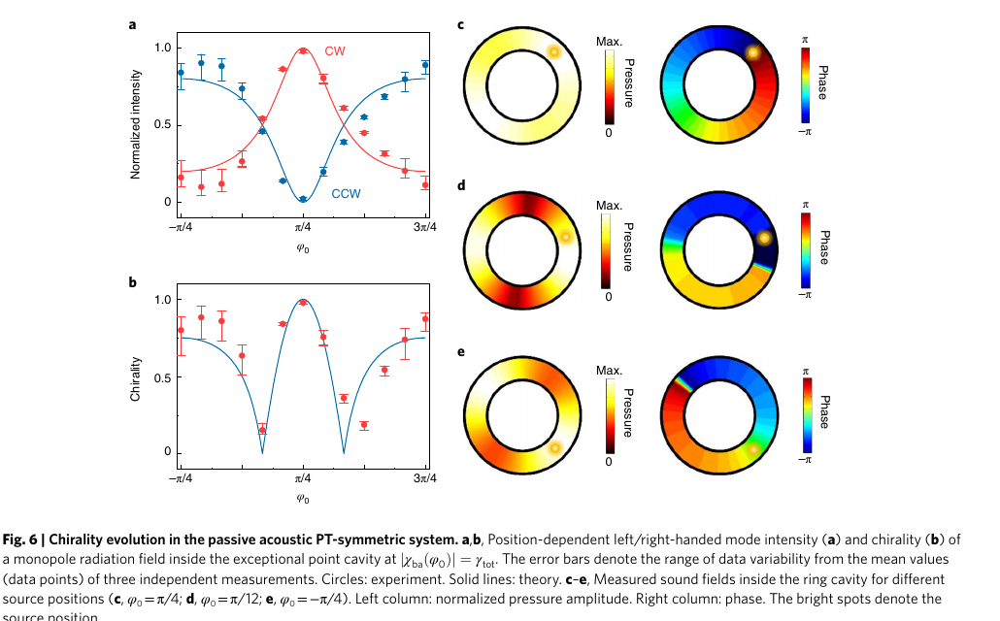

# Revealing the missing dimension at an exceptional point

学习版双语阅读稿

## Metadata

| Field | Value |
|---|---|
| Title | Revealing the missing dimension at an exceptional point |
| Authors | Hua-Zhou Chen, Tuo Liu, Hong-Yi Luan, Rong-Juan Liu, Xing-Yuan Wang, Xue-Feng Zhu, Yuan-Bo Li, Zhong-Ming Gu, Shan-Jun Liang, He Gao, Ling Lu, Li Ge, Shuang Zhang, Jie Zhu, Ren-Min Ma |
| Journal | Nature Physics 16, 571-578 (2020) |
| DOI | 10.1038/s41567-020-0807-y |
| Zotero item | GBHX46SI |
| PDF attachment | X8Q38BJ7 |
| Source pages | 9-page main article PDF; supplementary PDF exists as GCZ7VLL8 |

## One-Sentence Thesis

At an exceptional point, the environment of an emitter is not fully described by its coalesced eigenstate; the emitter response is governed by the Green's function/resolvent and can radiate into the generalized Jordan vector, exposing the "missing dimension" of the defective Hilbert space.

中文一句话：在 EP 处，环境不能只用合并本征态来描述；单个发射源的辐射响应会显现 Jordan vector 这个广义本征方向，因此出现与本征态手性相反的辐射场。

## Terminology Ledger

| Term | 中文 | Reading Choice |
|---|---|---|
| exceptional point, EP | 异常点 / 非厄米简并点 | 本文的核心：本征值和本征态同时合并，矩阵不可对角化。 |
| coalesced eigenstate | 合并本征态 | EP 处剩下的唯一本征态。 |
| Jordan vector | Jordan 向量 / 广义本征向量 | 满足 `(H - omega I) J = psi_EP` 的缺失维度，不是普通本征态。 |
| missing dimension | 缺失维度 | 指本征态基底不完备后需要 Jordan vector 补上的 Hilbert-space 方向。 |
| chirality reversal | 手性反转 | 发射场的 CW/CCW 或 OAM 手性与合并本征态相反。 |
| whispering-gallery mode, WGM | 回音壁模式 | 环形腔中的顺/逆时针传播模式。 |
| Green's function | Green 函数 | 发射源到辐射场的响应函数，比只看本征态更直接。 |
| PT-symmetric ring cavity | PT 对称环形腔 | 通过实部和虚部折射率调制实现非厄米耦合。 |

## Section Index

| Block | Pages | Role |
|---|---:|---|
| S001 | 1 | Abstract: challenge to eigenstate-only environment picture |
| S002 | 1 | Background and gap: EP makes the Hilbert-space basis incomplete |
| F001 | 2 | Fig. 1: conceptual mechanism |
| S003 | 2 | Coupled-mode model: normal ring versus EP ring |
| S004 | 2-3 | Mechanism: destructive interference and Jordan-vector radiation |
| F002 | 4 | Fig. 2: microwave near-field evidence |
| S005 | 3-4 | Electromagnetic experiment: PT microwave ring and travelling-wave evidence |
| F003 | 4 | Fig. 3: far-field vortex/OAM evidence |
| F004 | 5 | Fig. 4: position and frequency dependence of chirality |
| S006 | 5-6 | Acoustic experiment: generality beyond electromagnetics |
| F005 | 6 | Fig. 5: acoustic chirality reversal |
| F006 | 6 | Fig. 6: acoustic source-position evolution |
| S007 | 7 | Conclusions and implications |
| S008 | 9 | Methods details useful for reproduction |

---

<a id="S001"></a>
## S001 - Abstract Core

**Source:** p.1, abstract

**Original:** The radiation of electromagnetic and mechanical waves depends on both the emitter and the surrounding environment. The conventional picture treats the environment as being defined by its eigenstates, but this article reports an experimental breakdown of that picture at an exceptional point. A single emitter in a ring cavity shows chirality reversal, and the radiation field reveals the Jordan vector, the missing dimension of the Hilbert space.

**中文:** 电磁波和机械波的辐射不仅由发射源本身决定，也由周围环境决定。传统图像把环境等同于它的本征态集合，但本文证明：在异常点，两个本征态合并，普通本征态不再张成完整空间，单个发射源的辐射场会显现出 Jordan vector 这个缺失方向。实验上表现为环形腔中的手性反转。

**Reading Note:** 文章不是单纯说“EP 模式有手性”，而是说“源激发的响应场可以和 EP 本征态完全解耦”。这是比模式观测更强的论断。

---

<a id="S002"></a>
## S002 - Why Eigenstates Are Not Enough

**Source:** p.1, introduction

**Original:** The usual wave-matter interaction paradigm assumes that an emitter radiates into the photonic or mechanical eigenstates of its environment. At an exceptional point, however, two or more eigenstates coalesce, the eigenstates do not span the entire Hilbert space, and one or more dimensions are missing. The missing dimensions are supplied by Jordan vectors.

**中文:** 常规的波-物质相互作用范式认为，发射源把能量辐射进环境的光学或力学本征态。问题在于，EP 处本征态合并，本征态基底不完备，Hilbert 空间少了维度。要补齐这个空间，需要引入 Jordan vector。本文要实验显示的正是这个“以前只在数学上存在”的缺失维度。

**Reading Note:** 这里的“dimension”不是几何空间维度，而是线性空间基底维度。EP 的奇异性不只体现在本征频率平方根劈裂，也体现在发射源的响应函数。

---

<a id="F001"></a>
## F001 - Figure 1: Mechanism Sketch



**Source:** p.2, Fig. 1

**Original Caption Digest:** A normal ring has two counterpropagating eigenstates, and an emitter excites both. At an exceptional point, the two eigenstates coalesce; a single emitter can decouple from the coalesced eigenstate and radiate into the missing dimension with opposite handedness.

**中文:** 正常环形腔里，CW 和 CCW 两个回音壁模式构成完整基底，单个发射源会激发二者。EP 环形腔里两个本征态合并，只剩一个合并本征态；在特定源位置和频率条件下，发射源不再辐射到这个合并本征态，而是辐射到 Jordan vector，对应手性反转。

---

<a id="S003"></a>
## S003 - Coupled-Mode Model

**Source:** p.2, General theoretical analysis

**Original:** The system starts from two degenerate counterpropagating WGMs, CW and CCW. A PT-symmetric refractive-index modulation couples them through position-dependent backscattering. At the exceptional point, the coupling becomes unidirectional because one coupling coefficient vanishes, and the Hamiltonian becomes defective with one coalesced eigenstate.

**中文:** 理论模型从两个简并的反向传播 WGM 出发：CW 与 CCW。通过沿方位角的复折射率调制，把实部调制和虚部损耗调制做成 PT 对称形式，从而诱导两个方向之间的耦合。在 EP 条件下，一个方向的耦合项消失，耦合变成单向，Hamiltonian 不可对角化，只剩一个合并本征态。

**Key Equations:**  

```text
d/dt [a_CW, a_CCW]^T =
[[i omega - gamma_tot, chi_ab],
 [chi_ba, i omega - gamma_tot]]
[a_CW, a_CCW]^T
```

At the experimental EP, the cavity eigenstate is CCW, but the source-excited field can become CW.

**Reading Note:** 这一步的物理直觉是“非厄米调制让反射不再互易对称”。在 EP，直接辐射与背散射通道可以对某一手性发生完全相消。

---

<a id="S004"></a>
## S004 - Why the Radiation Follows the Jordan Vector

**Source:** pp.2-3, coupled-mode and Green's-function analysis

**Original:** On resonance and at the correct emitter position, the amplitude ratio between counterclockwise and clockwise waves vanishes. The condition corresponds to complete destructive interference between the directly emitted and backscattered wave components. Green's-function analysis reaches the same result: at the exceptional point the response becomes unidirectional and follows the Jordan vector rather than the coalesced eigenstate.

**中文:** 当源频率在共振上、源位置满足相消条件时，CCW/CW 振幅比可以为零。这意味着虽然腔的合并本征态是 CCW，实际由单发射源激发出来的总场却是纯 CW，即 Jordan vector 方向。Green 函数给出同样结论：EP 处不能只看本征态，因为响应函数中与 Jordan chain 相关的项支配了源激发场。

**Important Distinction:** EP laser 与本文的单发射源辐射不同。均匀增益的 EP 激光仍会按合并本征态出光；本文观测的是局域源的 Green-function response，因此能看到 Jordan vector。

---

<a id="F002"></a>
## F002 - Figure 2: Microwave Ring Evidence



**Source:** p.4, Fig. 2

**Original Caption Digest:** A PT-symmetric microwave ring cavity is fabricated using germanium ridges and air grooves. The measured phase and amplitude of the single-emitter radiation field show chirality reversal relative to a normal cavity.

**中文:** 图 2 是微波环形腔的第一组实验证据。Ge ridge 和 air groove 分别调控虚部与实部折射率，构造无源但等效 PT 对称的 EP。单偶极天线激发时，测得的场在环内呈 travelling wave，而普通环形腔中则是 standing wave。红色曲线/圆点显示反手性的相位线性变化。

---

<a id="S005"></a>
## S005 - Electromagnetic Experimental Verification

**Source:** pp.3-4

**Original:** The authors construct a passive PT-symmetric coaxial microwave cavity. The cavity is tuned to an exceptional point with a coalesced CCW eigenstate. A dipole antenna placed at the loss-region centre acts as a single source. Measurements show that the single-dipole radiation field is a travelling wave and displays the opposite chirality to the coalesced eigenstate.

**中文:** 电磁实验用同轴微波腔实现 EP：腔的本征态合并为 CCW 模式，但单个偶极天线放在损耗区域中心后，实际激发的辐射场是相反手性的 travelling wave。相位几乎线性从 `-pi` 到 `pi`，幅度节点消失，这与普通环形腔的 standing wave 完全不同。

**Reading Note:** 这里作者实际上证明了两个层次：腔本身确实处在 EP；源激发响应不等于 EP 本征态，而是与其手性相反。

---

<a id="F003"></a>
## F003 - Figure 3: Vortex Radiation



**Source:** p.4, Fig. 3

**Original Caption Digest:** The single-emitter-excited far-field vortex has a topological charge opposite to that of the coalesced cavity eigenstate.

**中文:** 图 3 把环内反手性转化为远场涡旋辐射证据。窄缝泄漏出的远场相位有涡旋奇点，并携带非零 OAM。测量与仿真都显示：单发射源激发的涡旋手性和腔合并本征态相反。

**Reading Note:** 这是文章标题里“revealing”的关键实验图之一：Jordan vector 不只是数学对象，而是可以通过辐射场的 OAM/涡旋手性直接看见。

---

<a id="F004"></a>
## F004 - Figure 4: Position and Frequency Dependence



**Source:** p.5, Fig. 4

**Original Caption Digest:** Chirality depends on emitter position and excitation frequency. At the designed condition, chirality reaches nearly unity; detuning away from resonance reduces the contrast.

**中文:** 图 4 说明这个现象不是随便发生的，而是由源位置与频率共同调控。手性定义为强弱传播分量的归一化对比度，实验最大达到约 `0.995`。当频率偏离共振，左右手分量对比减弱；普通腔或远离共振时呈零手性的 standing wave。

**Design Lesson:** 要实现反手性辐射，需要同时满足 EP、源位置、损耗/耦合匹配和共振频率条件。

---

<a id="S006"></a>
## S006 - Acoustic System: Generality Test

**Source:** pp.5-6

**Original:** The same Jordan-vector and chirality-reversal phenomenon is demonstrated in a passive acoustic PT-symmetric ring cavity. The real-part modulation is implemented with metagrooves; the imaginary-part modulation is implemented with lossy microperforated boundaries. A monopole sound source excites a sound field with chirality opposite to the cavity eigenmode.

**中文:** 为了证明这不是电磁系统的偶然特性，作者又做了声学实验。声学环形腔用亚波长凹槽实现实部折射率调制，用微穿孔泄漏边界实现损耗调制。结果和微波系统一致：合并本征态是一个方向，但单个声源激发出的声场可以是相反手性。

**Reading Note:** 这一步扩大了结论的适用性。文章的主张不只是“光学 EP 有这个效应”，而是“波-物质相互作用在 EP 处的 Green 函数结构普遍包含 Jordan-vector 响应”。

---

<a id="F005"></a>
## F005 - Figure 5: Acoustic Chirality Reversal



**Source:** p.6, Fig. 5

**Original Caption Digest:** The passive acoustic ring cavity shows the same chirality-reversal pattern. Measured pressure amplitude and phase agree with theory and simulations.

**中文:** 图 5 是声学版的反手性实验证明。黑色箭头表示声强矢量，显示合并本征态和单声源激发场方向相反。幅度和相位数据中，普通声学环腔是 standing wave，而 PT 对称 EP 环腔的单声源激发场具有 travelling-wave 特征。

---

<a id="F006"></a>
## F006 - Figure 6: Source-Position Evolution



**Source:** p.6, Fig. 6

**Original Caption Digest:** As the monopole source position changes, the chirality of the acoustic field evolves continuously. At some positions the field becomes a standing wave; at others it follows or reverses relative to the eigenmode.

**中文:** 图 6 展示声源位置如何连续调控声场手性。源在 `phi0 = pi/4` 附近时出现反手性；在特定位置两方向幅度相等，形成 standing wave；离开这些条件后，声场手性又趋向本征模方向。它说明源与非厄米环境之间的相互作用本身就是一个可调自由度。

---

<a id="S007"></a>
## S007 - Conclusions

**Source:** p.7

**Original:** The experiments reveal chirality-reversal radiation at an exceptional point and directly observe the wave function associated with the Jordan vector. The result shows that the radiation field of an emitter can become fully decoupled from the eigenstates of its environment. It also enables vortex radiation with tunable chirality from a simple linearly polarized dipole or monopole source.

**中文:** 结论是：作者实验揭示了 EP 处的反手性辐射，并通过辐射场直接观测到 Jordan vector 对应的波函数。这说明发射源的辐射场可以与环境本征态完全解耦。应用层面上，它提供了一种用简单线偏振偶极源或单极声源直接产生可调手性涡旋辐射的新机制。

**Critical Meaning:** 本文把 EP 从“本征频谱和本征态的奇异点”推进到“源响应函数的奇异点”。这对研究非对称辐射、OAM 辐射、手性量子光学和声学涡旋都很重要。

---

<a id="S008"></a>
## S008 - Methods Notes

**Source:** p.9

**Original:** The microwave cavity uses stainless-steel coaxial geometry with germanium ridges and air grooves; the excitation frequency range is around 8.150-8.270 GHz, and the resonant frequency at the exceptional point is around 8.212 GHz. The acoustic simulation uses air as background medium and a rectangular ring waveguide with engineered metagrooves and lossy walls.

**中文:** 复现实验时，微波系统的关键是同轴不锈钢腔、Ge ridge、air groove、单天线源以及上方探针扫描；工作频段约 `8.15-8.27 GHz`，EP 共振约 `8.212 GHz`。声学系统的关键是矩形截面环形波导、内壁 metagroove 实部调制和微穿孔板损耗调制。

**Reproduction Risk:** 方法部分给了几何与材料参数，但真正难点在于同时调到 EP、损耗匹配、源位置匹配和相位测量校准。补充材料应包含耦合系数、Green 函数推导和声学边界实现细节。

## Critical Reading Notes

1. The novelty is not merely observing a chiral EP eigenmode. The novelty is that a localized emitter response can avoid the coalesced eigenstate and excite the Jordan vector.
2. The physical mechanism can be read two equivalent ways: coupled-mode destructive interference, or Green's-function dominance of the generalized eigenvector at a defective point.
3. The strongest evidence chain is Fig. 1 mechanism -> Fig. 2 microwave near-field -> Fig. 3 far-field vortex -> Fig. 5-6 acoustic replication.
4. The effect is highly conditional. It requires EP tuning, resonant excitation, correct emitter position, and appropriate loss/coupling balance.
5. For asymmetric-radiation theory, the actionable insight is to design the environment's resolvent and source overlap, not only its eigenmodes.

## What To Read Next In The Supplement

The main article points to supplementary sections for:

| Topic | Why it matters |
|---|---|
| Coupled-mode derivation | Confirms how `chi_ab`, `chi_ba`, `gamma_tot`, and source position enter the destructive-interference condition. |
| Green's function derivation | Most important for theory: shows why the Jordan vector appears in the source response. |
| SALT / EP laser comparison | Prevents confusing single-emitter response with uniform-gain lasing. |
| Microwave fabrication and measurement | Needed if reproducing Fig. 2-4. |
| Acoustic boundary design | Needed if adapting the mechanism to mechanical/acoustic systems. |
